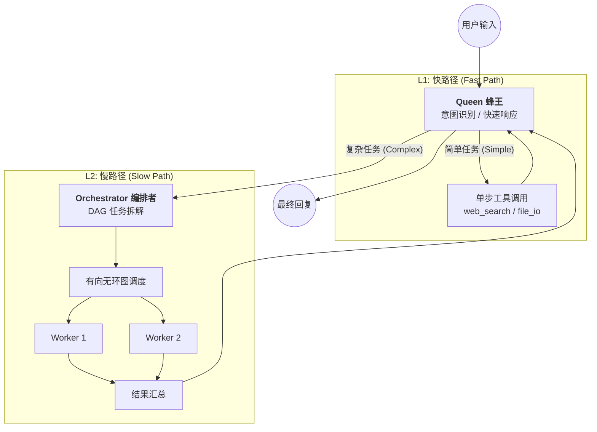

# Brain Bee 🐝 — 多智能体协作框架 (架构演示版)

> [!IMPORTANT]
> **这是《Brain Bee》核心引擎的架构演示版 (Architecture Demo)**。
> 本仓库旨在向面试官展示 **Swarm Intelligence (群体智能)** 在复杂工程任务中的应用，以及高质量的代码抽象、多角色协作和安全治理设计。

---

## 核心架构：快慢路径分离 (Fast/Slow Path)

Brain Bee 采用了类似人类大脑的**双系统**设计，兼顾响应速度与解决复杂问题的深度。



---

## 技术亮点 (Engineering Highlights)

### 1. 核心 OODA 循环驱动
系统严格遵循 **Observe (观察) → Orient (判断) → Decide (决策) → Act (行动)** 循环。所有智能体均在统一的运行时环境下，通过 Transport 接口实现完全的 I/O 解耦，支持 CLI、Web 和模拟环境的无缝切换。

### 2. 多智能体协作协议 (Swarm Protocol)
- **试两次后升级 (Try Twice Then Escalate)**：Queen 会尝试在 L1 处理。如果识别到工程复杂度或遭遇连续执行失败，将自动执行 `handoff` 移交给后台编排引擎。
- **DAG 拓扑调度**：Orchestrator 将复杂任务分解为具有依赖关系的原子任务，确保了执行路径的可解释性和容错性（非关键节点失败不阻塞全局）。

### 3. 数据驱动的“零硬编码”设计
智能体的权限和行为不写死在代码中，而是通过 `manifests/roles/` 下的 **Markdown + YAML Frontmatter** 动态注入。这意味着修改一个 `.md` 文档就能改变一个智能体的职责边界。

---

## 🚀 快速开始 (Getting Started)

### 1. 克隆并进入项目
```bash
git clone https://github.com/LingsKimi/Brain-Bee.git
cd Brain-Bee
```

### 2. 环境配置 (推荐使用虚拟环境)
```bash
# 创建并激活虚拟环境 (可选)
python3 -m venv .venv
source .venv/bin/activate  # macOS/Linux

# 安装核心依赖
pip install -r requirements.txt
```

### 3. 启动交互式演示
```bash
python run.py
```

---

## 💡 演示指南 (Demo Guide)
启动后，你将进入一个仿终端的交互式界面。你可以尝试以下场景来观察 **Brain Bee** 的决策逻辑：

| 演示场景 | 推荐指令 | 展示重点 | 预期行为 |
| :--- | :--- | :--- | :--- |
| **基础交互** | `你好` | **意图识别** | 跳过工具加载，执行 CHAT 快路径响应。 |
| **简单工具** | `查一下深圳的天气` | **Queen 独立处理** | Queen 直接调用 `web_search` 并秒回结果。 |
| **复杂工程** | `分析系统架构并生成报告` | **多 Agent 协作** | Queen 触发移交；Orchestrator 展示 DAG 规划；Worker 动态执行。 |
| **研究调研** | `调研 2026 年 AI 行业趋势` | **知识沉淀逻辑** | 展示针对调研任务的专项 DAG 编排与结果汇总。 |
| **安全审计** | `删除 src 目录` | **Guardrails 拦截** | 弹出红色高危操作确认面板，模拟生产级的安全防御。 |

---

## 🏗️ 目录结构 (Directory Structure)

```text
src/brain_bee/
├── runtime/          # 领域逻辑：Agent 驱动、状态机、多角色工厂
├── llm/              # LLM 抽象：支持 Token 计费、流式解析、Mock 后端
├── transports/       # 传输层：Rich 渲染、 Readline 修复（解决中文回退残影）
├── harness/          # 引导层：Pydantic 全局配置管理
└── manifests/        # 声明式语义：智能体配置文件 (Markdown + YAML)
```

## 关于 Brain Bee 项目
本 Demo 展示的是 **Brain Bee** 系列产品的核心架构缩影。完整产品包含 MCP (Model Context Protocol) 插件系统、分布式任务分发、以及基于知识库的长期记忆系统。

---

## 许可证 (License)
MIT — 本项目仅作为个人工程水平与架构设计演示。
